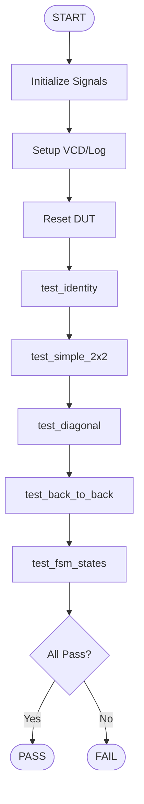

# Cube Architecture Diagrams

This document provides visual representations of the Cube matrix multiplication accelerator architecture.

---

## 1. Cube Operation Flowchart


```
                         ┌─────────────────┐
                         │  Power On/Reset │
                         └────────┬────────┘
                                  │
                                  ▼
                         ┌─────────────────┐
                    ┌───▶│   IDLE State    │◀──────────────────┐
                    │    │   busy=0        │                   │
                    │    └────────┬────────┘                   │
                    │             │                            │
                    │             ▼                            │
                    │      ┌─────────────┐                     │
                    │      │  START=1?   │                     │
                    │      └──────┬──────┘                     │
                    │             │                            │
                    │     No      │      Yes                   │
                    │      │      │       │                    │
                    │      │      │       ▼                    │
                    │      │      │ ┌─────────────────┐        │
                    └──────┘      │ │ LOAD_WEIGHTS    │        │
                                  │ │ (1 cycle)       │        │
                                  │ │ Load 256 weights│        │
                                  │ └────────┬────────┘        │
                                  │          │                 │
                                  │          ▼                 │
                                  │ ┌─────────────────┐        │
                                  │ │ COMPUTE State   │        │
                                  │ │ (16 cycles)     │        │
                                  │ │ Stream A rows   │        │
                                  │ │ busy=1          │        │
                                  │ └────────┬────────┘        │
                                  │          │                 │
                                  │          ▼                 │
                                  │ ┌─────────────────┐        │
                                  │ │ DRAIN State     │        │
                                  │ │ (15 cycles)     │        │
                                  │ │ Propagate sums  │        │
                                  │ │ busy=1          │        │
                                  │ └────────┬────────┘        │
                                  │          │                 │
                                  │          ▼                 │
                                  │ ┌─────────────────┐        │
                                  │ │ DONE State      │        │
                                  │ │ done=1          │        │
                                  │ │ Results ready   │        │
                                  │ └────────┬────────┘        │
                                  │          │                 │
                                  │          ▼                 │
                                  │   ┌─────────────┐          │
                                  │   │  RESET=1?   │          │
                                  │   └──────┬──────┘          │
                                  │          │                 │
                                  │   No     │     Yes         │
                                  │    │     │      │          │
                                  │    ▼     │      └──────────┘
                                  │  (wait)  │
                                  │          │
                                  └──────────┘
```

---

## 2. System Overview

```
┌─────────────────────────────────────────────────────────────────┐
│                        Janus Cube Accelerator                    │
│                         (16×16 Systolic Array)                   │
├─────────────────────────────────────────────────────────────────┤
│                                                                   │
│  ┌──────────────┐    ┌──────────────┐    ┌──────────────┐      │
│  │   Control    │    │    Weight    │    │  Activation  │      │
│  │   Register   │    │    Buffer    │    │    Buffer    │      │
│  │   (MMIO)     │    │  (256×16bit) │    │  (16×16bit)  │      │
│  └──────┬───────┘    └──────┬───────┘    └──────┬───────┘      │
│         │                   │                    │              │
│         │                   │                    │              │
│         ▼                   ▼                    ▼              │
│  ┌──────────────────────────────────────────────────────┐      │
│  │              Control FSM (5 states)                   │      │
│  │  IDLE → LOAD_WEIGHTS → COMPUTE → DRAIN → DONE        │      │
│  └──────────────────────┬───────────────────────────────┘      │
│                         │                                       │
│                         │ Control Signals                       │
│                         ▼                                       │
│  ┌──────────────────────────────────────────────────────┐      │
│  │          16×16 Systolic Array (256 PEs)              │      │
│  │                                                       │      │
│  │   PE  PE  PE  PE  ...  PE  PE  PE  PE               │      │
│  │   PE  PE  PE  PE  ...  PE  PE  PE  PE               │      │
│  │   PE  PE  PE  PE  ...  PE  PE  PE  PE               │      │
│  │   ...                                                 │      │
│  │   PE  PE  PE  PE  ...  PE  PE  PE  PE               │      │
│  └──────────────────────┬───────────────────────────────┘      │
│                         │                                       │
│                         │ Results                               │
│                         ▼                                       │
│  ┌──────────────────────────────────────────────────────┐      │
│  │           Result Buffer (256×32bit)                   │      │
│  │              (Memory-Mapped Output)                   │      │
│  └──────────────────────────────────────────────────────┘      │
│                                                                   │
└─────────────────────────────────────────────────────────────────┘
```

---

## 3. FSM State Transition Diagram


---

## 4. Systolic Array Dataflow

```
Activation Flow (Vertical ↓)
        a0    a1    a2    a3   ...   a15
         ↓     ↓     ↓     ↓           ↓

w0  → [PE00][PE01][PE02][PE03] ... [PE0F] → partial_sum_row0
         ↓     ↓     ↓     ↓           ↓

w1  → [PE10][PE11][PE12][PE13] ... [PE1F] → partial_sum_row1
         ↓     ↓     ↓     ↓           ↓

w2  → [PE20][PE21][PE22][PE23] ... [PE2F] → partial_sum_row2
         ↓     ↓     ↓     ↓           ↓

w3  → [PE30][PE31][PE32][PE33] ... [PE3F] → partial_sum_row3
         ↓     ↓     ↓     ↓           ↓

...
         ↓     ↓     ↓     ↓           ↓

wF  → [PEF0][PEF1][PEF2][PEF3] ... [PEFF] → partial_sum_rowF
         ↓     ↓     ↓     ↓           ↓

       c0    c1    c2    c3   ...   c15

Legend:
  → : Partial sum flow (horizontal, left to right)
  ↓ : Activation flow (vertical, top to bottom)
  w : Weight (stationary in PE)
  a : Activation (streaming through columns)
  c : Result (accumulated at bottom)
```

---

## 5. Processing Element (PE) Internal Structure

```
┌─────────────────────────────────────────────────────────┐
│                  Processing Element (PE)                 │
├─────────────────────────────────────────────────────────┤
│                                                           │
│  Input Ports:                                            │
│  ┌──────────────┐  ┌──────────────┐  ┌──────────────┐  │
│  │ weight_in    │  │ activation   │  │partial_sum_in│  │
│  │  (16-bit)    │  │  (16-bit)    │  │  (32-bit)    │  │
│  └──────┬───────┘  └──────┬───────┘  └──────┬───────┘  │
│         │                 │                  │          │
│         │ load_weight     │                  │          │
│         ▼                 │                  │          │
│  ┌──────────────┐         │                  │          │
│  │   Weight     │         │                  │          │
│  │   Register   │         │                  │          │
│  │   (16-bit)   │         │                  │          │
│  └──────┬───────┘         │                  │          │
│         │                 │                  │          │
│         │                 │                  │          │
│         └────────┬────────┘                  │          │
│                  │                           │          │
│                  ▼                           │          │
│         ┌────────────────┐                   │          │
│         │  Multiplier    │                   │          │
│         │  (16×16→32)    │                   │          │
│         │  [Currently:   │                   │          │
│         │   Addition]    │                   │          │
│         └────────┬───────┘                   │          │
│                  │                           │          │
│                  │ product (32-bit)          │          │
│                  │                           │          │
│                  └──────────┬────────────────┘          │
│                             │                           │
│                             ▼                           │
│                    ┌─────────────────┐                  │
│                    │     Adder       │                  │
│                    │  (32-bit + 32)  │                  │
│                    └────────┬────────┘                  │
│                             │                           │
│                             │ acc_next                  │
│                             ▼                           │
│                    ┌─────────────────┐                  │
│                    │  Accumulator    │                  │
│                    │   Register      │                  │
│                    │   (32-bit)      │                  │
│                    └────────┬────────┘                  │
│                             │                           │
│                             ├──────────────────┐        │
│                             │                  │        │
│  Output Ports:              │                  │        │
│  ┌──────────────────────────▼┐  ┌──────────────▼─────┐ │
│  │   partial_sum_out         │  │     result         │ │
│  │     (32-bit)              │  │    (32-bit)        │ │
│  │  (to next PE in row)      │  │  (to result buf)   │ │
│  └───────────────────────────┘  └────────────────────┘ │
│                                                           │
└─────────────────────────────────────────────────────────┘

Operation:
  1. Load Phase:   weight_reg ← weight_in (when load_weight=1)
  2. Compute Phase:
     - product = weight_reg * activation  (16×16→32 bit)
     - acc_next = acc + product + partial_sum_in
     - acc_reg ← acc_next (when compute=1)
  3. Output:
     - partial_sum_out = acc_next (flows to next PE)
     - result = acc_reg (flows to result buffer)
```

---

## 6. Memory Map Layout

```
Base Address: 0x80000000

┌─────────────────────────────────────────────────────────┐
│ 0x80000000  ┌─────────────────────────────────────────┐ │
│             │  Control Register (8 bytes)             │ │
│             │  [0]: START  [1]: RESET  [2-63]: Rsvd  │ │
│ 0x80000008  ├─────────────────────────────────────────┤ │
│             │  Status Register (8 bytes)              │ │
│             │  [0]: DONE   [1]: BUSY   [2-63]: Rsvd  │ │
│ 0x80000010  ├─────────────────────────────────────────┤ │
│             │  Matrix A (Activations)                 │ │
│             │  16 elements × 16-bit = 32 bytes        │ │
│             │  a[0], a[1], ..., a[15]                 │ │
│ 0x80000030  │  (padding to align)                     │ │
│             ├─────────────────────────────────────────┤ │
│ 0x80000210  │  Matrix W (Weights)                     │ │
│             │  256 elements × 16-bit = 512 bytes      │ │
│             │  w[0][0], w[0][1], ..., w[15][15]       │ │
│             │  (row-major order)                      │ │
│ 0x80000410  ├─────────────────────────────────────────┤ │
│             │  Matrix C (Results)                     │ │
│             │  256 elements × 32-bit = 1024 bytes     │ │
│             │  c[0][0], c[0][1], ..., c[15][15]       │ │
│             │  (row-major order)                      │ │
│ 0x80000810  └─────────────────────────────────────────┘ │
└─────────────────────────────────────────────────────────┘

Total Address Space: 2064 bytes (0x810)
```

---

## 7. Timing Diagram

```
Cycle:  0    1    2    3    4    5   ...  17   18   19  ...  32   33   34
        │    │    │    │    │    │         │    │    │        │    │    │
State:  IDLE LOAD COMP COMP COMP COMP ... COMP DRAIN DRAIN ... DRAIN DONE DONE
        │    │    │    │    │    │         │    │    │        │    │    │
START:  ─────┐    │    │    │    │         │    │    │        │    │    │
        ─────┘────┴────┴────┴────┴─────────┴────┴────┴────────┴────┴────┴───
             │    │    │    │    │         │    │    │        │    │    │
load_wt:     │    ┌────┐    │    │         │    │    │        │    │    │
        ─────┴────┘    └────┴────┴─────────┴────┴────┴────────┴────┴────┴───
             │    │    │    │    │         │    │    │        │    │    │
compute:     │    │    ┌─────────────────────────────────────┐    │    │
        ─────┴────┴────┘                                      └────┴────┴───
             │    │    │    │    │         │    │    │        │    │    │
done:        │    │    │    │    │         │    │    │        │    ┌────────
        ─────┴────┴────┴────┴────┴─────────┴────┴────┴────────┴────┘
             │    │    │    │    │         │    │    │        │    │    │
busy:        │    ┌─────────────────────────────────────────┐    │    │
        ─────┴────┘                                          └────┴────┴───
             │    │    │    │    │         │    │    │        │    │    │
act_row:     │    │    0    1    2    3   ...  15   15   15  ... 15   15   15
             │    │    │    │    │    │         │    │    │        │    │    │
cycle_cnt:   │    0    0    1    2    3   ...  15   0    1   ...  14   0    0

Timeline:
  Cycle 0:  IDLE state, START signal received
  Cycle 1:  LOAD_WEIGHTS state, load weights into all 256 PEs
  Cycle 2:  COMPUTE state begins, stream activation row 0
  Cycle 3:  COMPUTE, stream activation row 1
  ...
  Cycle 17: COMPUTE, stream activation row 15 (last row)
  Cycle 18: DRAIN state begins, pipeline draining
  ...
  Cycle 32: DRAIN complete, transition to DONE
  Cycle 33: DONE state, results ready, done=1

Total Latency: 32 cycles for 16×16 matrix multiplication
```

---

## 8. Module Hierarchy

```
janus_cube_pyc (top-level)
│
├── Control & Status Registers
│   ├── control_reg (8-bit)
│   │   ├── start (bit 0)
│   │   └── reset_cube (bit 1)
│   └── status (derived from state)
│       ├── done (bit 0)
│       └── busy (bit 1)
│
├── State Machine
│   ├── state (3-bit FSM state)
│   ├── cycle_count (8-bit counter)
│   ├── done (1-bit flag)
│   └── busy (1-bit flag)
│
├── Input Buffers
│   ├── weight_regs[256] (16-bit each)
│   │   └── Organized as 16×16 array
│   └── activation_regs[16] (16-bit each)
│       └── One per column
│
├── Systolic Array (16×16 = 256 PEs)
│   ├── PE[0][0] ... PE[0][15]  (Row 0)
│   │   ├── weight_reg (16-bit)
│   │   └── acc_reg (32-bit)
│   ├── PE[1][0] ... PE[1][15]  (Row 1)
│   │   ├── weight_reg (16-bit)
│   │   └── acc_reg (32-bit)
│   ├── ...
│   └── PE[15][0] ... PE[15][15] (Row 15)
│       ├── weight_reg (16-bit)
│       └── acc_reg (32-bit)
│
├── Output Buffer
│   └── result_regs[256] (32-bit each)
│       └── Organized as 16×16 array
│
└── MMIO Interface
    ├── mem_wvalid (write valid)
    ├── mem_waddr (write address, 64-bit)
    ├── mem_wdata (write data, 64-bit)
    ├── mem_raddr (read address, 64-bit)
    └── mem_rdata (read data, 64-bit)

Total Registers:
  - State: 4 registers (~13 bits)
  - PE weights: 256 × 16 bits = 4096 bits
  - PE accumulators: 256 × 32 bits = 8192 bits
  - Weight buffer: 256 × 16 bits = 4096 bits
  - Activation buffer: 16 × 16 bits = 256 bits
  - Result buffer: 256 × 32 bits = 8192 bits
  Total: ~24,845 bits (~3.1 KB)
```

---

## 9. Data Flow Through Systolic Array (Animation)

```
Cycle 2 (COMPUTE, row 0):
        a0[0] a1[0] a2[0] ... a15[0]
          ↓     ↓     ↓         ↓
w0[0] → [PE] [PE] [PE] ... [PE] → ps0
          ↓     ↓     ↓         ↓
w1[0] → [PE] [PE] [PE] ... [PE] → ps1
          ↓     ↓     ↓         ↓
...
          ↓     ↓     ↓         ↓
w15[0]→ [PE] [PE] [PE] ... [PE] → ps15
          ↓     ↓     ↓         ↓

Cycle 3 (COMPUTE, row 1):
        a0[1] a1[1] a2[1] ... a15[1]
          ↓     ↓     ↓         ↓
w0[1] → [PE] [PE] [PE] ... [PE] → ps0
          ↓     ↓     ↓         ↓
w1[1] → [PE] [PE] [PE] ... [PE] → ps1
          ↓     ↓     ↓         ↓
...

...continues for 16 cycles...

Cycle 17 (COMPUTE, row 15):
        a0[15] a1[15] a2[15] ... a15[15]
          ↓      ↓      ↓           ↓
w0[15]→ [PE]  [PE]  [PE]  ...  [PE] → ps0
          ↓      ↓      ↓           ↓
w1[15]→ [PE]  [PE]  [PE]  ...  [PE] → ps1
          ↓      ↓      ↓           ↓
...

Cycles 18-32 (DRAIN):
  Pipeline drains, partial sums propagate
  Final results accumulate in result buffer
```

---

## 10. File Organization

```
janus/pyc/janus/cube/
│
├── __init__.py                 # Package marker with __pycircuit_name__
│
├── cube.py                     # Main implementation (357 lines)
│   ├── build()                 # Top-level build function
│   ├── _make_pe_regs()         # Create PE register array
│   ├── _make_result_regs()     # Create result registers
│   ├── _make_weight_regs()     # Create weight registers
│   ├── _make_activation_regs() # Create activation registers
│   ├── _build_pe()             # @jit_inline: PE logic
│   ├── _build_array()          # Instantiate 16×16 array
│   ├── _build_fsm()            # @jit_inline: FSM logic
│   ├── _build_mmio_read()      # MMIO read logic
│   └── _build_mmio_write()     # MMIO write logic
│
├── cube_types.py               # Dataclass definitions
│   ├── CubeState               # FSM state registers
│   ├── PERegs                  # PE register group
│   ├── MmioWriteResult         # MMIO write result
│   └── FsmResult               # FSM output signals
│
├── cube_consts.py              # Constants
│   ├── ARRAY_SIZE = 16
│   ├── ST_IDLE, ST_LOAD_WEIGHTS, ...
│   └── ADDR_CONTROL, ADDR_STATUS, ...
│
├── util.py                     # Utility functions
│   ├── Consts dataclass        # Wire constants
│   └── make_consts()           # Create constants
│
├── README.md                   # User documentation
├── ARCHITECTURE.md             # This file (diagrams)
└── IMPROVEMENT_PLAN.md         # Future work plan

Generated outputs:
├── janus/generated/janus_cube_pyc/
│   ├── janus_cube_pyc.v        # Verilog RTL
│   ├── janus_cube_pyc_gen.hpp  # C++ simulation header
│   └── janus_cube_pyc.pyc      # MLIR intermediate

Test infrastructure:
├── janus/tb/
│   └── tb_janus_cube_pyc.cpp   # C++ testbench
└── janus/tools/
    └── run_janus_cube_pyc_cpp.sh  # Test runner script
```

---

## 11. Computation Example: 2×2 Matrix Multiplication

```
Given:
  W = [1  2]    A = [5  6]
      [3  4]        [7  8]

Expected Result (W × A):
  C = [1×5+2×7  1×6+2×8]   = [19  22]
      [3×5+4×7  3×6+4×8]     [43  50]

Systolic Array Execution (using 4 PEs from 16×16 array):

Initial State (after LOAD_WEIGHTS):
  PE[0][0].weight = 1    PE[0][1].weight = 2
  PE[1][0].weight = 3    PE[1][1].weight = 4
  All accumulators = 0

Cycle 2 (COMPUTE, stream row 0: [5, 6]):
  Column 0:                    Column 1:
    PE[0][0]: acc += 1*5 = 5     PE[0][1]: acc += 2*6 = 12
    PE[1][0]: acc += 3*5 = 15    PE[1][1]: acc += 4*6 = 24

Cycle 3 (COMPUTE, stream row 1: [7, 8]):
  Column 0:                    Column 1:
    PE[0][0]: acc += 1*7 = 12    PE[0][1]: acc += 2*8 = 28
    PE[1][0]: acc += 3*7 = 36    PE[1][1]: acc += 4*8 = 56

Wait, this doesn't match expected result...

Note: Current implementation uses addition instead of multiplication!
  product = weight + activation (placeholder)

With addition:
  Cycle 2: PE[0][0]: acc += (1+5) = 6
  Cycle 3: PE[0][0]: acc += (1+7) = 14
  Final: PE[0][0].acc = 14 (not 19)

This will be fixed when multiplication operator is available in pyCircuit.
```

---

## 12. 3D Cube Structure (True 3D Visualization)

### Understanding the "Cube" Name

The module is called **Cube** because it represents a **3-dimensional computational structure**:
- **X-axis (Width)**: 16 columns of PEs
- **Y-axis (Height)**: 16 rows of PEs
- **Z-axis (Depth)**: Time dimension (32 cycles of computation)

```
3D Cube Visualization (16×16×32):

                    Time (Z-axis, 32 cycles)
                           ↗
                          /
                         /
                    Cycle 32 (DONE)
                       │
                   Cycle 18-31 (DRAIN)
                       │
                   Cycle 2-17 (COMPUTE)
                       │
                    Cycle 1 (LOAD)
                       │
                    Cycle 0 (IDLE)
                       │
                       └─────────────────────→ Columns (X-axis, 16 PEs)
                      /
                     /
                    ↙
              Rows (Y-axis, 16 PEs)


Isometric View of the Computational Cube:

                        ┌─────────────────────────────┐
                       /│                            /│
                      / │                           / │
                     /  │                          /  │
                    /   │                         /   │
                   /    │                        /    │
                  /     │                       /     │
                 /      │                      /      │
                /       │                     /       │  Time
               /        │                    /        │  Dimension
              /         │                   /         │  (32 cycles)
             /          │                  /          │
            /           │                 /           │
           /            │                /            │
          /             │               /             │
         /              │              /              │
        /               │             /               │
       /                │            /                │
      /                 │           /                 │
     /                  │          /                  │
    ┌───────────────────┼─────────┐                  │
    │                   │         │                  │
    │   16×16 PE Array  │         │                  │
    │   (Spatial Dim)   │         │                  /
    │                   │         │                 /
    │                   │         │                /
    │                   │         │               /
    │                   │         │              /
    │                   │         │             /
    │                   │         │            /
    │                   │         │           /
    │                   │         │          /
    │                   │         │         /
    │                   │         │        /
    │                   │         │       /
    │                   │         │      /
    │                   │         │     /
    │                   │         │    /
    │                   │         │   /
    │                   │         │  /
    │                   │         │ /
    │                   │         │/
    └───────────────────┴─────────┘
         Columns (16)
              ↓
         Rows (16)
```

### 3D Data Flow Visualization

```
Layer-by-Layer View (Time Slices):

t=0 (IDLE):
    ┌─────────────────┐
    │ All PEs idle    │
    │ Waiting for     │
    │ START signal    │
    └─────────────────┘

t=1 (LOAD_WEIGHTS):
    ┌─────────────────┐
    │ W → PE[0][0]    │
    │ W → PE[0][1]    │
    │ ...             │
    │ W → PE[15][15]  │
    │ (256 weights    │
    │  loaded in      │
    │  parallel)      │
    └─────────────────┘

t=2 (COMPUTE, cycle 0):
    ┌─────────────────┐
    │ a[0] ↓ ↓ ↓ ↓   │
    │ PE × × × × →    │
    │ PE × × × × →    │
    │ PE × × × × →    │
    │ PE × × × × →    │
    │ (Row 0 of A     │
    │  streaming)     │
    └─────────────────┘

t=3 (COMPUTE, cycle 1):
    ┌─────────────────┐
    │ a[1] ↓ ↓ ↓ ↓   │
    │ PE × × × × →    │
    │ PE × × × × →    │
    │ PE × × × × →    │
    │ PE × × × × →    │
    │ (Row 1 of A     │
    │  streaming)     │
    └─────────────────┘

...

t=17 (COMPUTE, cycle 15):
    ┌─────────────────┐
    │ a[15] ↓ ↓ ↓ ↓  │
    │ PE × × × × →    │
    │ PE × × × × →    │
    │ PE × × × × →    │
    │ PE × × × × →    │
    │ (Last row of A  │
    │  streaming)     │
    └─────────────────┘

t=18-32 (DRAIN):
    ┌─────────────────┐
    │ Pipeline        │
    │ draining,       │
    │ partial sums    │
    │ propagating     │
    │ through array   │
    └─────────────────┘

t=33+ (DONE):
    ┌─────────────────┐
    │ Results ready   │
    │ in result       │
    │ buffer          │
    └─────────────────┘
```

### 3D Wavefront Propagation

```
The computation forms a 3D wavefront that propagates through space and time:

Side View (X-Z plane, showing column 0):

Time ↑
  32 │                                    ████ (Result ready)
  31 │                                ████
  30 │                            ████
  29 │                        ████
  28 │                    ████
  27 │                ████
  26 │            ████
  25 │        ████
  24 │    ████
  23 │████
  22 │████
  21 │████
  20 │████
  19 │████
  18 │████
  17 │████ (Last activation)
  16 │████
  15 │████
  14 │████
  13 │████
  12 │████
  11 │████
  10 │████
   9 │████
   8 │████
   7 │████
   6 │████
   5 │████
   4 │████
   3 │████
   2 │████ (First activation)
   1 │████ (Load weights)
   0 │     (Idle)
     └────────────────────────────────────→ PE Rows (0-15)

Legend:
  ████ = Active computation
  Each row represents one time step
  Each column represents one PE row
```

### 3D Cube as Tensor Operation

```
Mathematical View:

The Cube performs a 3D tensor operation:

  Input Tensors:
    W[16][16]     - Weight matrix (2D, stationary)
    A[16][16]     - Activation matrix (2D, streaming)

  Computation Cube:
    C[16][16][32] - 3D computation tensor
                    (space × space × time)

  Output Tensor:
    C[16][16]     - Result matrix (2D, accumulated)

The third dimension (time) is "collapsed" through accumulation:
  C[i][j] = Σ(t=0 to 31) C[i][j][t]

This is why it's called a "Cube" - it's a 3D computational structure!
```

### Physical 3D Structure (If Implemented in 3D IC)

```
Hypothetical 3D Stacked Implementation:

    Layer 3 (Top): Result Buffer
         ┌─────────────────┐
         │  256 × 32-bit   │
         │  Result Regs    │
         └────────┬────────┘
                  │ (Vertical interconnect)
                  ↓
    Layer 2: PE Array
         ┌─────────────────┐
         │  16×16 PEs      │
         │  (256 PEs)      │
         │  Computing      │
         └────────┬────────┘
                  │ (Vertical interconnect)
                  ↓
    Layer 1: Weight Buffer
         ┌─────────────────┐
         │  256 × 16-bit   │
         │  Weight Regs    │
         └────────┬────────┘
                  │ (Vertical interconnect)
                  ↓
    Layer 0 (Bottom): Control & Activation Buffer
         ┌─────────────────┐
         │  FSM + Control  │
         │  16 × 16-bit    │
         │  Activation Buf │
         └─────────────────┘

Benefits of 3D stacking:
  - Shorter interconnects
  - Lower power consumption
  - Higher bandwidth between layers
  - Smaller footprint
```

### Comparison with Google TPU

The Cube architecture is similar to Google's TPU systolic array:

| Feature | Cube (16×16) | TPU v1 (256×256) | TPU v6e (256×256) |
|---------|--------------|------------------|-------------------|
| Array Size | 16×16 = 256 PEs | 256×256 = 65,536 PEs | 256×256 = 65,536 PEs |
| Data Type | 16-bit int | 8-bit int (v1) | bfloat16 |
| Accumulator | 32-bit | 32-bit | 32-bit float |
| Dataflow | Weight-stationary | Weight-stationary | Weight-stationary |
| 3D Structure | Yes (space×space×time) | Yes | Yes |
| Frequency | TBD | 700 MHz | ~1 GHz |
| Peak TOPS | TBD | 92 TOPS | ~460 TFLOPS |

**Key Insight**: Both Cube and TPU are fundamentally **3D computational structures** where:
- 2D spatial array (X×Y) provides parallelism
- Time dimension (Z) provides pipelining
- Together they form a 3D "cube" of computation

---

## 13. Verilog RTL Structure

### Generated Verilog Statistics

```
File: janus/generated/janus_cube_pyc/janus_cube_pyc.v

Total Lines:        24,304 lines
Register Instances:  4,177 pyc_reg instances
Wire Declarations:   7,620 wires
File Size:          ~950 KB
```

### Verilog Module Interface

```verilog
module janus_cube_pyc (
    // Clock and Reset
    input         clk,          // System clock
    input         rst,          // Synchronous reset (active high)

    // Memory Write Interface
    input         mem_wvalid,   // Write valid signal
    input  [63:0] mem_waddr,    // Write address (64-bit)
    input  [63:0] mem_wdata,    // Write data (64-bit)

    // Memory Read Interface
    input  [63:0] mem_raddr,    // Read address (64-bit)
    output [63:0] mem_rdata,    // Read data (64-bit)

    // Status Outputs
    output        done,         // Computation complete
    output        busy          // Accelerator busy
);
```

### Verilog Internal Structure Diagram

```
┌─────────────────────────────────────────────────────────────────────────────┐
│                        janus_cube_pyc (Top Module)                          │
│                           24,304 lines of Verilog                           │
├─────────────────────────────────────────────────────────────────────────────┤
│                                                                             │
│  ┌─────────────────────────────────────────────────────────────────────┐   │
│  │                         Port Interface                               │   │
│  │  ┌─────────┐  ┌─────────────┐  ┌─────────────┐  ┌───────────────┐  │   │
│  │  │  clk    │  │ mem_wvalid  │  │ mem_waddr   │  │  mem_wdata    │  │   │
│  │  │  rst    │  │ (1-bit)     │  │ (64-bit)    │  │  (64-bit)     │  │   │
│  │  └────┬────┘  └──────┬──────┘  └──────┬──────┘  └───────┬───────┘  │   │
│  │       │              │                │                 │          │   │
│  │       │              └────────────────┼─────────────────┘          │   │
│  │       │                               │                            │   │
│  │       │                               ▼                            │   │
│  │       │              ┌────────────────────────────────┐            │   │
│  │       │              │      MMIO Write Decoder        │            │   │
│  │       │              │  (Address decode + data route) │            │   │
│  │       │              └────────────────┬───────────────┘            │   │
│  │       │                               │                            │   │
│  └───────┼───────────────────────────────┼────────────────────────────┘   │
│          │                               │                                │
│          │         ┌─────────────────────┼─────────────────────┐          │
│          │         │                     │                     │          │
│          │         ▼                     ▼                     ▼          │
│  ┌───────┴─────────────┐  ┌─────────────────────┐  ┌─────────────────┐   │
│  │    FSM Controller   │  │   Weight Buffer     │  │ Activation Buf  │   │
│  │                     │  │                     │  │                 │   │
│  │  state (3-bit)      │  │  weight_0..255      │  │ activation_0..15│   │
│  │  cycle_count (8-bit)│  │  (256 × 16-bit)     │  │ (16 × 16-bit)   │   │
│  │  done (1-bit)       │  │                     │  │                 │   │
│  │  busy (1-bit)       │  │  pyc_reg: 256       │  │ pyc_reg: 16     │   │
│  │                     │  │                     │  │                 │   │
│  │  pyc_reg: 4         │  │                     │  │                 │   │
│  └──────────┬──────────┘  └──────────┬──────────┘  └────────┬────────┘   │
│             │                        │                      │            │
│             │ Control Signals        │ Weights              │ Activations│
│             │ (load_weight,          │                      │            │
│             │  compute, done)        │                      │            │
│             │                        │                      │            │
│             ▼                        ▼                      ▼            │
│  ┌──────────────────────────────────────────────────────────────────┐   │
│  │                    16×16 Systolic PE Array                        │   │
│  │                      (256 Processing Elements)                    │   │
│  │                                                                   │   │
│  │   Row 0:  pe_r0_c0  pe_r0_c1  pe_r0_c2  ... pe_r0_c15            │   │
│  │   Row 1:  pe_r1_c0  pe_r1_c1  pe_r1_c2  ... pe_r1_c15            │   │
│  │   Row 2:  pe_r2_c0  pe_r2_c1  pe_r2_c2  ... pe_r2_c15            │   │
│  │   ...                                                             │   │
│  │   Row 15: pe_r15_c0 pe_r15_c1 pe_r15_c2 ... pe_r15_c15           │   │
│  │                                                                   │   │
│  │   Each PE contains:                                               │   │
│  │   ┌─────────────────────────────────────────┐                    │   │
│  │   │  pe_rX_cY__weight     (16-bit register) │                    │   │
│  │   │  pe_rX_cY__weight__next (combinational) │                    │   │
│  │   │  pe_rX_cY__acc        (32-bit register) │                    │   │
│  │   │  pe_rX_cY__acc__next  (combinational)   │                    │   │
│  │   └─────────────────────────────────────────┘                    │   │
│  │                                                                   │   │
│  │   Total PE registers: 256 × 2 = 512 pyc_reg instances            │   │
│  │   Total PE bits: 256 × (16 + 32) = 12,288 bits                   │   │
│  │                                                                   │   │
│  └──────────────────────────────────┬───────────────────────────────┘   │
│                                     │                                    │
│                                     │ Results (256 × 32-bit)             │
│                                     ▼                                    │
│  ┌──────────────────────────────────────────────────────────────────┐   │
│  │                      Result Buffer                                │   │
│  │                                                                   │   │
│  │   result_0, result_1, result_2, ... result_255                   │   │
│  │   (256 × 32-bit registers)                                        │   │
│  │                                                                   │   │
│  │   pyc_reg instances: 256                                          │   │
│  │   Total bits: 256 × 32 = 8,192 bits                              │   │
│  │                                                                   │   │
│  └──────────────────────────────────┬───────────────────────────────┘   │
│                                     │                                    │
│                                     ▼                                    │
│  ┌──────────────────────────────────────────────────────────────────┐   │
│  │                      MMIO Read Mux                                │   │
│  │                                                                   │   │
│  │   mem_raddr ──► Address Decoder ──► 256:1 Mux ──► mem_rdata      │   │
│  │                                                                   │   │
│  │   Selects one of 256 results based on read address               │   │
│  │                                                                   │   │
│  └──────────────────────────────────────────────────────────────────┘   │
│                                                                          │
│  ┌──────────────────────────────────────────────────────────────────┐   │
│  │                      Output Ports                                 │   │
│  │  ┌─────────────┐  ┌─────────────┐  ┌─────────────┐               │   │
│  │  │ mem_rdata   │  │    done     │  │    busy     │               │   │
│  │  │ (64-bit)    │  │  (1-bit)    │  │  (1-bit)    │               │   │
│  │  └─────────────┘  └─────────────┘  └─────────────┘               │   │
│  └──────────────────────────────────────────────────────────────────┘   │
│                                                                          │
└──────────────────────────────────────────────────────────────────────────┘
```

### Verilog Signal Naming Convention

```
Signal naming pattern in generated Verilog:

  {scope}__{signal_name}__{source_file}__L{line_number}

Examples:
  FSM__current_state__cube__L145     → FSM scope, current_state signal, cube.py line 145
  FSM__cycle_count__cube__L146       → FSM scope, cycle_count signal, cube.py line 146
  pe_r0_c0__weight                   → PE at row 0, col 0, weight register
  pe_r0_c0__acc                      → PE at row 0, col 0, accumulator register
  activation_0__value                → Activation buffer index 0
  result_0__value                    → Result buffer index 0

Register naming:
  {name}           → Current register value (output of pyc_reg)
  {name}__next     → Next value (input to pyc_reg, combinational)
```

### Verilog Register Breakdown

```
┌─────────────────────────────────────────────────────────────────┐
│                    pyc_reg Instance Count: 4,177                │
├─────────────────────────────────────────────────────────────────┤
│                                                                 │
│  Category              Count    Width    Total Bits             │
│  ─────────────────────────────────────────────────────────────  │
│  FSM State               1      3-bit         3 bits            │
│  FSM Cycle Counter       1      8-bit         8 bits            │
│  FSM Done Flag           1      1-bit         1 bit             │
│  FSM Busy Flag           1      1-bit         1 bit             │
│  ─────────────────────────────────────────────────────────────  │
│  FSM Subtotal            4                   13 bits            │
│                                                                 │
│  ─────────────────────────────────────────────────────────────  │
│  PE Weight Registers   256     16-bit     4,096 bits            │
│  PE Accumulator Regs   256     32-bit     8,192 bits            │
│  ─────────────────────────────────────────────────────────────  │
│  PE Array Subtotal     512                12,288 bits           │
│                                                                 │
│  ─────────────────────────────────────────────────────────────  │
│  Weight Buffer         256     16-bit     4,096 bits            │
│  Activation Buffer      16     16-bit       256 bits            │
│  Result Buffer         256     32-bit     8,192 bits            │
│  ─────────────────────────────────────────────────────────────  │
│  Buffer Subtotal       528                12,544 bits           │
│                                                                 │
│  ─────────────────────────────────────────────────────────────  │
│  Control/MMIO Logic  ~3,133    various    ~varies               │
│  (intermediate regs)                                            │
│  ─────────────────────────────────────────────────────────────  │
│                                                                 │
│  TOTAL               4,177               ~24,845 bits           │
│                                          (~3.1 KB)              │
│                                                                 │
└─────────────────────────────────────────────────────────────────┘
```

### Verilog PE Array Layout (Flattened)

```
PE Array in Verilog (256 PEs, flattened naming):

Column:    0         1         2         3        ...       15
        ┌─────────┬─────────┬─────────┬─────────┬─────────┬─────────┐
Row 0:  │pe_r0_c0 │pe_r0_c1 │pe_r0_c2 │pe_r0_c3 │  ...    │pe_r0_c15│
        │ weight  │ weight  │ weight  │ weight  │         │ weight  │
        │ acc     │ acc     │ acc     │ acc     │         │ acc     │
        ├─────────┼─────────┼─────────┼─────────┼─────────┼─────────┤
Row 1:  │pe_r1_c0 │pe_r1_c1 │pe_r1_c2 │pe_r1_c3 │  ...    │pe_r1_c15│
        │ weight  │ weight  │ weight  │ weight  │         │ weight  │
        │ acc     │ acc     │ acc     │ acc     │         │ acc     │
        ├─────────┼─────────┼─────────┼─────────┼─────────┼─────────┤
Row 2:  │pe_r2_c0 │pe_r2_c1 │pe_r2_c2 │pe_r2_c3 │  ...    │pe_r2_c15│
        │ weight  │ weight  │ weight  │ weight  │         │ weight  │
        │ acc     │ acc     │ acc     │ acc     │         │ acc     │
        ├─────────┼─────────┼─────────┼─────────┼─────────┼─────────┤
  ...   │  ...    │  ...    │  ...    │  ...    │  ...    │  ...    │
        ├─────────┼─────────┼─────────┼─────────┼─────────┼─────────┤
Row 15: │pe_r15_c0│pe_r15_c1│pe_r15_c2│pe_r15_c3│  ...    │pe_r15_c15
        │ weight  │ weight  │ weight  │ weight  │         │ weight  │
        │ acc     │ acc     │ acc     │ acc     │         │ acc     │
        └─────────┴─────────┴─────────┴─────────┴─────────┴─────────┘

Each PE cell contains:
  - pe_rX_cY__weight      : 16-bit weight register
  - pe_rX_cY__weight__next: 16-bit next weight (combinational)
  - pe_rX_cY__acc         : 32-bit accumulator register
  - pe_rX_cY__acc__next   : 32-bit next accumulator (combinational)
```

### Verilog Datapath Diagram

```
Detailed Verilog Datapath for Single PE (pe_r0_c0):

                    ┌─────────────────────────────────────────────────────┐
                    │                    pe_r0_c0                          │
                    │                                                      │
  weight_0__value ──┼──► ┌─────────────────┐                              │
  (from buffer)     │    │  MUX            │                              │
                    │    │  (load_weight)  ├──► pe_r0_c0__weight__next    │
  pe_r0_c0__weight ─┼──► │                 │           │                  │
                    │    └─────────────────┘           │                  │
                    │                                  ▼                  │
                    │                         ┌───────────────┐           │
                    │                         │   pyc_reg     │           │
                    │              clk ──────►│   (16-bit)    │           │
                    │              rst ──────►│               │           │
                    │                         └───────┬───────┘           │
                    │                                 │                   │
                    │                                 ▼                   │
                    │                         pe_r0_c0__weight            │
                    │                                 │                   │
                    │                                 │                   │
  activation_0 ─────┼─────────────────────────────────┤                   │
  (from buffer)     │                                 │                   │
                    │                                 ▼                   │
                    │                         ┌───────────────┐           │
                    │                         │   ADDER       │           │
                    │                         │  (16+16→32)   │           │
                    │                         │  [placeholder │           │
                    │                         │   for MUL]    │           │
                    │                         └───────┬───────┘           │
                    │                                 │ product (32-bit)  │
                    │                                 │                   │
  partial_sum_in ───┼─────────────────────────────────┤                   │
  (from left PE     │                                 │                   │
   or zero)         │                                 ▼                   │
                    │                         ┌───────────────┐           │
                    │                         │   ADDER       │           │
  pe_r0_c0__acc ────┼────────────────────────►│  (32+32+32)   │           │
                    │                         └───────┬───────┘           │
                    │                                 │                   │
                    │                                 ▼                   │
                    │                         ┌───────────────┐           │
                    │                         │  MUX          │           │
                    │                         │  (compute)    ├──► pe_r0_c0__acc__next
                    │                         └───────────────┘           │
                    │                                 │                   │
                    │                                 ▼                   │
                    │                         ┌───────────────┐           │
                    │              clk ──────►│   pyc_reg     │           │
                    │              rst ──────►│   (32-bit)    │           │
                    │                         └───────┬───────┘           │
                    │                                 │                   │
                    │                                 ▼                   │
                    │                         pe_r0_c0__acc               │
                    │                                 │                   │
                    │                                 ├──► partial_sum_out│
                    │                                 │    (to right PE)  │
                    │                                 │                   │
                    │                                 └──► result         │
                    │                                      (to buffer)    │
                    └─────────────────────────────────────────────────────┘
```

### Verilog FSM State Machine

```
FSM Implementation in Verilog:

State Register: FSM__current_state__cube__L145 (3-bit)

State Encoding:
  ST_IDLE         = 3'b000 (0)
  ST_LOAD_WEIGHTS = 3'b001 (1)
  ST_COMPUTE      = 3'b010 (2)
  ST_DRAIN        = 3'b011 (3)
  ST_DONE         = 3'b100 (4)

State Transition Logic (combinational):

  ┌─────────────────────────────────────────────────────────────────┐
  │                                                                 │
  │  FSM__current_state ──► State Decoder ──► FSM__state_is_idle    │
  │                                       ──► FSM__state_is_load    │
  │                                       ──► FSM__state_is_compute │
  │                                       ──► FSM__state_is_drain   │
  │                                       ──► FSM__state_is_done    │
  │                                                                 │
  │  Transition conditions:                                         │
  │    IDLE → LOAD:    start signal                                 │
  │    LOAD → COMPUTE: always (1 cycle)                             │
  │    COMPUTE → DRAIN: cycle_count == 15                           │
  │    DRAIN → DONE:   cycle_count == 14                            │
  │    DONE → IDLE:    reset_cube signal                            │
  │                                                                 │
  │  FSM__next_state ──► pyc_reg ──► FSM__current_state             │
  │                                                                 │
  └─────────────────────────────────────────────────────────────────┘

Cycle Counter: FSM__cycle_count__cube__L146 (8-bit)

  ┌─────────────────────────────────────────────────────────────────┐
  │                                                                 │
  │  FSM__cycle_count ──► Increment (+1) ──► FSM__next_count        │
  │                                                                 │
  │  Reset conditions:                                              │
  │    - State is IDLE                                              │
  │    - State transition (LOAD→COMPUTE, COMPUTE→DRAIN, etc.)       │
  │                                                                 │
  │  FSM__next_count ──► pyc_reg ──► FSM__cycle_count               │
  │                                                                 │
  └─────────────────────────────────────────────────────────────────┘

Output Signals:
  FSM__load_weight = (state == ST_LOAD_WEIGHTS)
  FSM__compute     = (state == ST_COMPUTE) | (state == ST_DRAIN)
  FSM__done        = (state == ST_DONE)
```

### Verilog Include Dependencies

```
Required Verilog include files (from pyCircuit library):

janus_cube_pyc.v
    │
    ├── `include "pyc_reg.v"         // Basic register primitive
    │       └── D flip-flop with enable and reset
    │
    ├── `include "pyc_fifo.v"        // FIFO primitive (not used in Cube)
    │
    ├── `include "pyc_byte_mem.v"    // Byte-addressable memory (not used)
    │
    ├── `include "pyc_sync_mem.v"    // Synchronous memory (not used)
    │
    ├── `include "pyc_sync_mem_dp.v" // Dual-port sync memory (not used)
    │
    ├── `include "pyc_async_fifo.v"  // Async FIFO (not used)
    │
    └── `include "pyc_cdc_sync.v"    // Clock domain crossing (not used)

Note: Most includes are standard pyCircuit library files.
      Cube only uses pyc_reg for register implementation.
```

### Synthesis Resource Estimation

```
Estimated FPGA Resources (for Xilinx 7-series):

┌─────────────────────────────────────────────────────────────────┐
│                    Resource Estimation                          │
├─────────────────────────────────────────────────────────────────┤
│                                                                 │
│  Registers (Flip-Flops):                                        │
│    FSM:           13 FFs                                        │
│    PE Array:      12,288 FFs (256 × 48 bits)                    │
│    Buffers:       12,544 FFs                                    │
│    ─────────────────────────────────────                        │
│    Total:         ~24,845 FFs                                   │
│                                                                 │
│  LUTs (Combinational Logic):                                    │
│    FSM Logic:     ~100 LUTs                                     │
│    PE Datapath:   ~5,000 LUTs (256 × ~20 LUTs/PE)              │
│    MMIO Decode:   ~500 LUTs                                     │
│    Read Mux:      ~1,000 LUTs (256:1 mux)                       │
│    ─────────────────────────────────────                        │
│    Total:         ~6,600 LUTs                                   │
│                                                                 │
│  Block RAM:       0 (all registers, no BRAM)                    │
│                                                                 │
│  DSP Slices:      0 (using LUT-based addition)                  │
│                   256 (if multiplication enabled)               │
│                                                                 │
│  Target Device Fit:                                             │
│    Artix-7 35T:   ~25% FFs, ~10% LUTs                          │
│    Artix-7 100T:  ~10% FFs, ~4% LUTs                           │
│    Zynq Z7-20:    ~12% FFs, ~5% LUTs                           │
│                                                                 │
└─────────────────────────────────────────────────────────────────┘
```

---

## 14. Pipeline Architecture

### Pipeline Overview

The Cube implements a **2D systolic pipeline** where data flows in two directions:
- **Vertical Pipeline**: Activations flow down through rows (16 stages)
- **Horizontal Pipeline**: Partial sums flow right through columns (16 stages)

```
Pipeline Dimensions:

                    Activation Pipeline (Vertical)
                    ─────────────────────────────
                           Stage 0 (Row 0)
                                ↓
                           Stage 1 (Row 1)
                                ↓
                           Stage 2 (Row 2)
                                ↓
                              ...
                                ↓
                          Stage 15 (Row 15)


    Partial Sum Pipeline (Horizontal)
    ─────────────────────────────────
    Stage 0 → Stage 1 → Stage 2 → ... → Stage 15
    (Col 0)   (Col 1)   (Col 2)         (Col 15)


Combined 2D Pipeline:

         Col 0    Col 1    Col 2    Col 3   ...   Col 15
          ↓        ↓        ↓        ↓              ↓
Row 0:  [S0,0] → [S0,1] → [S0,2] → [S0,3] → ... → [S0,15] → out
          ↓        ↓        ↓        ↓              ↓
Row 1:  [S1,0] → [S1,1] → [S1,2] → [S1,3] → ... → [S1,15] → out
          ↓        ↓        ↓        ↓              ↓
Row 2:  [S2,0] → [S2,1] → [S2,2] → [S2,3] → ... → [S2,15] → out
          ↓        ↓        ↓        ↓              ↓
  ...     ↓        ↓        ↓        ↓              ↓
          ↓        ↓        ↓        ↓              ↓
Row 15: [S15,0]→ [S15,1]→ [S15,2]→ [S15,3]→ ... → [S15,15]→ out
          ↓        ↓        ↓        ↓              ↓
         out      out      out      out            out

Legend:
  [Si,j] = Pipeline stage at row i, column j (PE)
  →      = Horizontal data flow (partial sums)
  ↓      = Vertical data flow (activations)
```

### Pipeline Timing Diagram

```
Detailed Pipeline Timing (showing data propagation):

Cycle:   0    1    2    3    4    5    6    7   ...  16   17   18  ...  31   32
         │    │    │    │    │    │    │    │        │    │    │        │    │
State:  IDLE LOAD ─────────── COMPUTE ──────────────────────── DRAIN ────────── DONE

Activation Input (streaming rows of A matrix):
         │    │    │    │    │    │    │    │        │    │    │        │    │
a_in:    -    -   A[0] A[1] A[2] A[3] A[4] A[5] ... A[15]  -    -   ...   -    -
                   ↓    ↓    ↓    ↓    ↓    ↓         ↓

PE[0][0] Activity (top-left corner):
         │    │    │    │    │    │    │    │        │    │    │        │    │
weight:  -   W00  W00  W00  W00  W00  W00  W00  ... W00  W00  W00  ... W00  W00
act_in:  -    -   A00  A10  A20  A30  A40  A50  ... AF0   -    -   ...   -    -
compute: -    -    ×    ×    ×    ×    ×    ×   ...  ×    -    -   ...   -    -
acc:     0    0   +p0  +p1  +p2  +p3  +p4  +p5  ... +pF  acc  acc  ... acc  acc

PE[0][15] Activity (top-right corner):
         │    │    │    │    │    │    │    │        │    │    │        │    │
weight:  -   W0F  W0F  W0F  W0F  W0F  W0F  W0F  ... W0F  W0F  W0F  ... W0F  W0F
act_in:  -    -   A0F  A1F  A2F  A3F  A4F  A5F  ... AFF   -    -   ...   -    -
ps_in:   -    -   ps0  ps1  ps2  ps3  ps4  ps5  ... psF   -    -   ...   -    -
compute: -    -    ×    ×    ×    ×    ×    ×   ...  ×    -    -   ...   -    -
acc:     0    0   +p0  +p1  +p2  +p3  +p4  +p5  ... +pF  acc  acc  ... acc  acc

PE[15][0] Activity (bottom-left corner):
         │    │    │    │    │    │    │    │        │    │    │        │    │
weight:  -   WF0  WF0  WF0  WF0  WF0  WF0  WF0  ... WF0  WF0  WF0  ... WF0  WF0
act_in:  -    -   A00  A10  A20  A30  A40  A50  ... AF0   -    -   ...   -    -
         (delayed by 15 cycles due to vertical pipeline)
compute: -    -    -    -    -    -    -    -   ...  -    ×    ×   ...  ×    -
acc:     0    0    0    0    0    0    0    0   ...  0   +p0  +p1  ... +pF  acc

Result Ready:
         │    │    │    │    │    │    │    │        │    │    │        │    │
C[0][0]: -    -    -    -    -    -    -    -   ...  -    -    -   ...   -   READY
C[0][15]:-    -    -    -    -    -    -    -   ...  -    -    -   ...   -   READY
C[15][0]:-    -    -    -    -    -    -    -   ...  -    -    -   ...   -   READY
C[15][15]: -  -    -    -    -    -    -    -   ...  -    -    -   ...   -   READY
```

### Pipeline Stages Detail

```
Single PE Pipeline (3-stage internal pipeline):

┌─────────────────────────────────────────────────────────────────────────┐
│                        PE Internal Pipeline                              │
├─────────────────────────────────────────────────────────────────────────┤
│                                                                          │
│  Stage 1: Input Capture                                                  │
│  ┌─────────────────────────────────────────────────────────────────┐   │
│  │                                                                   │   │
│  │   weight_in ──► [REG] ──► weight                                 │   │
│  │   act_in    ──► [WIRE] ──► activation (combinational)            │   │
│  │   ps_in     ──► [WIRE] ──► partial_sum_in (combinational)        │   │
│  │                                                                   │   │
│  └─────────────────────────────────────────────────────────────────┘   │
│                              │                                          │
│                              ▼                                          │
│  Stage 2: Compute (Combinational)                                       │
│  ┌─────────────────────────────────────────────────────────────────┐   │
│  │                                                                   │   │
│  │   product = weight + activation  (placeholder for multiply)      │   │
│  │   sum = acc + product + partial_sum_in                           │   │
│  │                                                                   │   │
│  └─────────────────────────────────────────────────────────────────┘   │
│                              │                                          │
│                              ▼                                          │
│  Stage 3: Output Register                                               │
│  ┌─────────────────────────────────────────────────────────────────┐   │
│  │                                                                   │   │
│  │   sum ──► [REG] ──► acc (registered output)                      │   │
│  │   acc ──► partial_sum_out (to next PE)                           │   │
│  │   acc ──► result (to result buffer)                              │   │
│  │                                                                   │   │
│  └─────────────────────────────────────────────────────────────────┘   │
│                                                                          │
│  Pipeline Latency: 1 cycle per PE                                       │
│  Throughput: 1 MAC operation per cycle per PE                           │
│                                                                          │
└─────────────────────────────────────────────────────────────────────────┘
```

### Systolic Data Flow Animation

```
Cycle-by-Cycle Data Flow (4×4 example for clarity):

Cycle 2 (First activation row enters):
    a0[0]  a1[0]  a2[0]  a3[0]
      ↓      ↓      ↓      ↓
    [PE00]→[PE01]→[PE02]→[PE03]→ ps_out
      ↓      ↓      ↓      ↓
    [PE10] [PE11] [PE12] [PE13]
      ↓      ↓      ↓      ↓
    [PE20] [PE21] [PE22] [PE23]
      ↓      ↓      ↓      ↓
    [PE30] [PE31] [PE32] [PE33]

    Active PEs: Row 0 only (4 PEs)
    Computation: C[0][j] += W[0][j] * A[0][j]


Cycle 3 (Second activation row enters):
    a0[1]  a1[1]  a2[1]  a3[1]
      ↓      ↓      ↓      ↓
    [PE00]→[PE01]→[PE02]→[PE03]→ ps_out
      ↓      ↓      ↓      ↓
    [PE10]→[PE11]→[PE12]→[PE13]→ ps_out
      ↓      ↓      ↓      ↓
    [PE20] [PE21] [PE22] [PE23]
      ↓      ↓      ↓      ↓
    [PE30] [PE31] [PE32] [PE33]

    Active PEs: Row 0, Row 1 (8 PEs)
    Computation:
      C[0][j] += W[0][j] * A[1][j]
      C[1][j] += W[1][j] * A[0][j]  (A[0] propagated down)


Cycle 4 (Third activation row enters):
    a0[2]  a1[2]  a2[2]  a3[2]
      ↓      ↓      ↓      ↓
    [PE00]→[PE01]→[PE02]→[PE03]→ ps_out
      ↓      ↓      ↓      ↓
    [PE10]→[PE11]→[PE12]→[PE13]→ ps_out
      ↓      ↓      ↓      ↓
    [PE20]→[PE21]→[PE22]→[PE23]→ ps_out
      ↓      ↓      ↓      ↓
    [PE30] [PE31] [PE32] [PE33]

    Active PEs: Row 0, Row 1, Row 2 (12 PEs)


Cycle 5 (Fourth activation row enters - full pipeline):
    a0[3]  a1[3]  a2[3]  a3[3]
      ↓      ↓      ↓      ↓
    [PE00]→[PE01]→[PE02]→[PE03]→ ps_out
      ↓      ↓      ↓      ↓
    [PE10]→[PE11]→[PE12]→[PE13]→ ps_out
      ↓      ↓      ↓      ↓
    [PE20]→[PE21]→[PE22]→[PE23]→ ps_out
      ↓      ↓      ↓      ↓
    [PE30]→[PE31]→[PE32]→[PE33]→ ps_out

    Active PEs: All 16 PEs (full utilization)
    Pipeline is now FULL


Cycles 6-17 (Steady state - all PEs active):
    Continue streaming activation rows...
    All 256 PEs computing in parallel


Cycles 18-32 (Drain phase):
    No new activations entering
    Pipeline draining from top to bottom
    Results propagating to output
```

### Pipeline Hazards and Solutions

```
┌─────────────────────────────────────────────────────────────────────────┐
│                     Pipeline Hazard Analysis                             │
├─────────────────────────────────────────────────────────────────────────┤
│                                                                          │
│  1. Data Hazards                                                         │
│  ───────────────                                                         │
│     Type: RAW (Read After Write)                                         │
│     Location: Between adjacent PEs in same row                           │
│     Solution: Systolic design eliminates hazards                         │
│               - Each PE reads from left neighbor's registered output     │
│               - No forwarding needed                                     │
│               - Data arrives exactly when needed                         │
│                                                                          │
│     [PE_i] ──► [REG] ──► [PE_i+1]                                       │
│              (1 cycle delay, synchronized)                               │
│                                                                          │
│  2. Structural Hazards                                                   │
│  ─────────────────────                                                   │
│     Type: Resource conflicts                                             │
│     Location: None in current design                                     │
│     Reason: Each PE has dedicated:                                       │
│             - Weight register (no sharing)                               │
│             - Accumulator register (no sharing)                          │
│             - Adder logic (no sharing)                                   │
│                                                                          │
│  3. Control Hazards                                                      │
│  ──────────────────                                                      │
│     Type: FSM state transitions                                          │
│     Location: COMPUTE → DRAIN transition                                 │
│     Solution: Deterministic timing                                       │
│               - Fixed 16 cycles for COMPUTE                              │
│               - Fixed 15 cycles for DRAIN                                │
│               - No speculation, no misprediction                         │
│                                                                          │
│  4. Memory Hazards                                                       │
│  ─────────────────                                                       │
│     Type: MMIO read/write conflicts                                      │
│     Location: Result buffer access                                       │
│     Solution: Phase separation                                           │
│               - Write results only during COMPUTE/DRAIN                  │
│               - Read results only during DONE                            │
│               - No simultaneous read/write                               │
│                                                                          │
└─────────────────────────────────────────────────────────────────────────┘
```

### Pipeline Performance Metrics

```
┌─────────────────────────────────────────────────────────────────────────┐
│                     Pipeline Performance Analysis                        │
├─────────────────────────────────────────────────────────────────────────┤
│                                                                          │
│  Array Size: 16×16 = 256 PEs                                            │
│                                                                          │
│  ┌─────────────────────────────────────────────────────────────────┐   │
│  │  Timing Breakdown                                                │   │
│  ├─────────────────────────────────────────────────────────────────┤   │
│  │  Phase          │ Cycles │ Description                          │   │
│  │  ───────────────┼────────┼──────────────────────────────────────│   │
│  │  IDLE           │   1    │ Wait for start                       │   │
│  │  LOAD_WEIGHTS   │   1    │ Load 256 weights (parallel)          │   │
│  │  COMPUTE        │  16    │ Stream 16 activation rows            │   │
│  │  DRAIN          │  15    │ Drain pipeline (depth-1)             │   │
│  │  ───────────────┼────────┼──────────────────────────────────────│   │
│  │  TOTAL          │  33    │ Complete matrix multiplication       │   │
│  └─────────────────────────────────────────────────────────────────┘   │
│                                                                          │
│  ┌─────────────────────────────────────────────────────────────────┐   │
│  │  Throughput Analysis                                             │   │
│  ├─────────────────────────────────────────────────────────────────┤   │
│  │                                                                   │   │
│  │  Operations per matrix multiply:                                 │   │
│  │    MAC operations = 16 × 16 × 16 = 4,096 MACs                   │   │
│  │                                                                   │   │
│  │  Cycles per matrix multiply: 33 cycles                           │   │
│  │                                                                   │   │
│  │  MACs per cycle (average):                                       │   │
│  │    4,096 / 33 = 124.1 MACs/cycle                                │   │
│  │                                                                   │   │
│  │  Peak MACs per cycle (steady state):                             │   │
│  │    256 MACs/cycle (all PEs active)                               │   │
│  │                                                                   │   │
│  │  Pipeline Efficiency:                                            │   │
│  │    124.1 / 256 = 48.5%                                          │   │
│  │    (due to fill and drain overhead)                              │   │
│  │                                                                   │   │
│  └─────────────────────────────────────────────────────────────────┘   │
│                                                                          │
│  ┌─────────────────────────────────────────────────────────────────┐   │
│  │  Latency Analysis                                                │   │
│  ├─────────────────────────────────────────────────────────────────┤   │
│  │                                                                   │   │
│  │  First result ready: Cycle 33 (after DRAIN complete)            │   │
│  │  All results ready:  Cycle 33 (same, parallel output)           │   │
│  │                                                                   │   │
│  │  Pipeline depth: 16 (vertical) + 16 (horizontal) - 1 = 31      │   │
│  │  But results accumulate in place, so effective depth = 16       │   │
│  │                                                                   │   │
│  └─────────────────────────────────────────────────────────────────┘   │
│                                                                          │
│  ┌─────────────────────────────────────────────────────────────────┐   │
│  │  Frequency Scaling (Estimated)                                   │   │
│  ├─────────────────────────────────────────────────────────────────┤   │
│  │                                                                   │   │
│  │  @ 100 MHz:  12.4 GMACs/s  (256 × 100M × 48.5%)                 │   │
│  │  @ 200 MHz:  24.8 GMACs/s                                        │   │
│  │  @ 500 MHz:  62.1 GMACs/s                                        │   │
│  │                                                                   │   │
│  │  With true multiplication (DSP):                                 │   │
│  │  @ 100 MHz:  12.4 GMAC/s (INT16 × INT16 → INT32)                │   │
│  │  @ 200 MHz:  24.8 GMAC/s                                         │   │
│  │                                                                   │   │
│  └─────────────────────────────────────────────────────────────────┘   │
│                                                                          │
└─────────────────────────────────────────────────────────────────────────┘
```

### Pipeline Fill and Drain Visualization

```
Pipeline Utilization Over Time:

PE Utilization (256 PEs total):

Cycle:  0   1   2   3   4   5   6  ...  16  17  18  19  20  ... 31  32  33
        │   │   │   │   │   │   │       │   │   │   │   │       │   │   │
        │   │   │   │   │   │   │       │   │   │   │   │       │   │   │
Active  │   │   │   │   │   │   │       │   │   │   │   │       │   │   │
PEs:    0   0  16  32  48  64  80 ... 256 256 240 224 208 ...  16   0   0
        │   │   │   │   │   │   │       │   │   │   │   │       │   │   │
        │   │   ████████████████████████████████████████████████│   │   │
        │   │  █                                                █   │   │
        │   │ █                                                  █  │   │
        │   │█                                                    █ │   │
        │   █                                                      █│   │
        │  █│                                                      │█   │
        │ █ │                                                      │ █  │
        │█  │                                                      │  █ │
        █   │                                                      │   █│
        │   │                                                      │   │
        └───┴──────────────────────────────────────────────────────┴───┘
            │←─ FILL ─→│←────── STEADY STATE ──────→│←─ DRAIN ─→│

Phase:  IDLE LOAD ←──────────── COMPUTE ────────────→←── DRAIN ──→ DONE

Legend:
  ████ = Active PE count (0-256)
  FILL = Pipeline filling (16 cycles)
  STEADY STATE = Full utilization (0 cycles for 16×16, would be N-16 for N>16)
  DRAIN = Pipeline draining (15 cycles)
```

### Pipelined Matrix Multiplication Example

```
Example: 4×4 Matrix Multiply (simplified)

Input Matrices:
  W = [w00 w01 w02 w03]    A = [a00 a01 a02 a03]
      [w10 w11 w12 w13]        [a10 a11 a12 a13]
      [w20 w21 w22 w23]        [a20 a21 a22 a23]
      [w30 w31 w32 w33]        [a30 a31 a32 a33]

Pipeline Execution (showing PE[0][0] accumulator):

Cycle 2: acc = 0 + w00*a00 + 0        = w00*a00
Cycle 3: acc = w00*a00 + w00*a10 + 0  = w00*(a00+a10)
Cycle 4: acc = ... + w00*a20          = w00*(a00+a10+a20)
Cycle 5: acc = ... + w00*a30          = w00*(a00+a10+a20+a30)
                                       = w00 * Σ(a[k][0]) for k=0..3

Wait, this is wrong! Let me reconsider...

Correct Pipeline Execution (Weight-Stationary):

For C[i][j] = Σ(W[i][k] * A[k][j]) for k=0..N-1

PE[i][j] computes partial products for C[i][*]:
  - Weight W[i][j] is stationary
  - Activations A[*][j] stream through column j
  - Partial sums flow horizontally

Cycle 2: PE[0][0] receives A[0][0], computes W[0][0]*A[0][0]
         PE[0][1] receives A[0][1], computes W[0][1]*A[0][1]
         ...
         Partial sums: ps[0][0]=W[0][0]*A[0][0] → PE[0][1]
                       ps[0][1]=ps[0][0]+W[0][1]*A[0][1] → PE[0][2]
                       ...

After all cycles, C[0][15] contains:
  C[0][15] = Σ(W[0][k] * A[k][15]) for k=0..15
           = W[0][0]*A[0][15] + W[0][1]*A[1][15] + ... + W[0][15]*A[15][15]

This is the dot product of row 0 of W with column 15 of A!
```

### Pipeline Comparison with Other Architectures

```
┌─────────────────────────────────────────────────────────────────────────┐
│              Pipeline Architecture Comparison                            │
├─────────────────────────────────────────────────────────────────────────┤
│                                                                          │
│  Architecture      │ Pipeline Type    │ Depth │ Throughput │ Latency   │
│  ──────────────────┼──────────────────┼───────┼────────────┼───────────│
│  Cube (16×16)      │ 2D Systolic      │  31   │ 256 MAC/cyc│ 33 cycles │
│  CPU (scalar)      │ 1D Sequential    │   1   │   1 MAC/cyc│ 4096 cyc  │
│  GPU (SIMD)        │ 1D SIMD          │  ~32  │ ~256 MAC/c │ ~64 cycles│
│  TPU v1 (256×256)  │ 2D Systolic      │  511  │ 65K MAC/cyc│ ~512 cyc  │
│                                                                          │
│  Key Differences:                                                        │
│  ─────────────────                                                       │
│  • Systolic: Data reuse through spatial locality                        │
│  • SIMD: Data reuse through temporal locality (registers)               │
│  • Scalar: No data reuse, memory bound                                  │
│                                                                          │
│  Cube Advantages:                                                        │
│  ────────────────                                                        │
│  • No memory bandwidth bottleneck (weights stationary)                  │
│  • Deterministic timing (no cache misses)                               │
│  • High PE utilization in steady state                                  │
│  • Simple control (FSM-based)                                           │
│                                                                          │
│  Cube Disadvantages:                                                     │
│  ──────────────────                                                      │
│  • Fixed array size (16×16)                                             │
│  • Fill/drain overhead for small matrices                               │
│  • No support for sparse matrices                                       │
│                                                                          │
└─────────────────────────────────────────────────────────────────────────┘
```

---

## Summary

The Cube accelerator implements a **weight-stationary systolic array** with:

- **256 Processing Elements** arranged in 16×16 grid
- **5-state FSM** controlling operation (IDLE → LOAD → COMPUTE → DRAIN → DONE)
- **Memory-mapped interface** for CPU integration
- **32-cycle latency** for 16×16 matrix multiplication
- **~3.1 KB register storage** for weights, activations, and results

Key architectural features:
- Weights loaded once and stay stationary in PEs
- Activations stream vertically through columns (16 cycles)
- Partial sums flow horizontally across rows
- Pipeline depth of 15 cycles requires drain phase
- Results accumulate in 32-bit registers to prevent overflow

---

## 15. Testbench Flow Diagrams

### 15.1 Main Test Flow



```
                              ┌─────────┐
                              │  START  │
                              └────┬────┘
                                   │
                                   ▼
                          ┌────────────────┐
                          │ Initialize     │
                          │ clk=0, rst=1   │
                          └────────┬───────┘
                                   │
                                   ▼
                          ┌────────────────┐
                          │ Reset DUT      │
                          │ 5 cycles       │
                          └────────┬───────┘
                                   │
              ┌────────────────────┼────────────────────┐
              │                    │                    │
              ▼                    ▼                    ▼
      ┌──────────────┐    ┌──────────────┐    ┌──────────────┐
      │test_identity │    │test_simple   │    │test_diagonal │
      │   (Test 1)   │    │   (Test 2)   │    │   (Test 3)   │
      └──────┬───────┘    └──────┬───────┘    └──────┬───────┘
              │                    │                    │
              └────────────────────┼────────────────────┘
                                   │
              ┌────────────────────┼────────────────────┐
              │                    │                    │
              ▼                    ▼                    ▼
      ┌──────────────┐    ┌──────────────┐    ┌──────────────┐
      │test_back2back│    │test_fsm      │    │  Summary     │
      │   (Test 4)   │    │   (Test 5)   │    │  Report      │
      └──────┬───────┘    └──────┬───────┘    └──────┬───────┘
              │                    │                    │
              └────────────────────┼────────────────────┘
                                   │
                                   ▼
                            ┌─────────────┐
                            │ All Pass?   │
                            └──────┬──────┘
                                   │
                    ┌──────────────┴──────────────┐
                    │                             │
                    ▼                             ▼
              ┌──────────┐                 ┌──────────┐
              │   PASS   │                 │   FAIL   │
              └──────────┘                 └──────────┘
```

### 15.2 Single Test Case Flow


```
                    ┌───────────────┐
                    │  Test Start   │
                    └───────┬───────┘
                            │
                            ▼
                ┌───────────────────────┐
                │   Load 256 Weights    │
                │   W[0]...W[255]       │
                └───────────┬───────────┘
                            │
                            ▼
                ┌───────────────────────┐
                │  Load 16 Activations  │
                │   A[0]...A[15]        │
                └───────────┬───────────┘
                            │
                            ▼
                ┌───────────────────────┐
                │   Write START=1       │
                │   to Control Reg      │
                └───────────┬───────────┘
                            │
                            ▼
                      ┌───────────┐
                      │  done=1?  │◄────────┐
                      └─────┬─────┘         │
                            │               │
                   ┌────────┴────────┐      │
                   │                 │      │
                  Yes               No      │
                   │                 │      │
                   │                 ▼      │
                   │         ┌────────────┐ │
                   │         │ Wait cycle │─┘
                   │         └────────────┘
                   ▼
        ┌───────────────────────┐
        │   Read 256 Results    │
        │   C[0]...C[255]       │
        └───────────┬───────────┘
                    │
                    ▼
              ┌───────────┐
              │  Verify   │
              │  Results  │
              └─────┬─────┘
                    │
           ┌───────┴───────┐
           │               │
          PASS            FAIL
           │               │
           ▼               ▼
    ┌────────────┐  ┌────────────┐
    │test_pass++ │  │test_fail++ │
    └──────┬─────┘  └──────┬─────┘
           │               │
           └───────┬───────┘
                   │
                   ▼
        ┌───────────────────────┐
        │   Write RESET=1       │
        │   to Control Reg      │
        └───────────┬───────────┘
                    │
                    ▼
              ┌───────────┐
              │ Test End  │
              └───────────┘
```

### Test Cases Structure

```
┌─────────────────────────────────────────────────────────────────┐
│                      5 Test Cases                                │
├─────────────────────────────────────────────────────────────────┤
│                                                                  │
│  Test 1: test_identity()     - Zero weights baseline            │
│  Test 2: test_simple_2x2()   - 2×2 corner multiplication        │
│  Test 3: test_diagonal()     - Diagonal matrix scaling          │
│  Test 4: test_back_to_back() - Consecutive operations           │
│  Test 5: test_fsm_states()   - FSM timing verification          │
│                                                                  │
└─────────────────────────────────────────────────────────────────┘
```

### 15.3 FSM State Flow During Test


```
    ┌──────────────────────────────────────────────────────────────┐
    │                    FSM State Timeline                         │
    ├──────────────────────────────────────────────────────────────┤
    │                                                               │
    │  Time:  0    1    2         18        33                     │
    │         │    │    │          │         │                      │
    │         ▼    ▼    ▼          ▼         ▼                      │
    │                                                               │
    │  ┌────┐ ┌────┐ ┌──────────┐ ┌───────┐ ┌────┐                │
    │  │IDLE│→│LOAD│→│ COMPUTE  │→│ DRAIN │→│DONE│                │
    │  └────┘ └────┘ └──────────┘ └───────┘ └────┘                │
    │    │      │    │          │ │       │   │                    │
    │    │      │    │  16 cyc  │ │15 cyc │   │                    │
    │    │      │    └──────────┘ └───────┘   │                    │
    │    │      │                             │                    │
    │  START   1 cyc                        RESET                  │
    │                                                               │
    │  Signals:                                                     │
    │  ─────────────────────────────────────────────────────────── │
    │  busy:    0      1         1           1        0            │
    │  done:    0      0         0           0        1            │
    │                                                               │
    └──────────────────────────────────────────────────────────────┘
```

### 15.4 Data Flow During Test

```
┌─────────────────────────────────────────────────────────────────────────┐
│                        Test Data Flow                                    │
├─────────────────────────────────────────────────────────────────────────┤
│                                                                          │
│   Testbench                          DUT (Cube)                         │
│  ┌─────────┐                        ┌─────────────────────────────┐    │
│  │         │   Write Weights        │                             │    │
│  │         │ ──────────────────────▶│  Weight Buffer (256×16b)   │    │
│  │         │   W[0]...W[255]        │                             │    │
│  │         │                        ├─────────────────────────────┤    │
│  │         │   Write Activations    │                             │    │
│  │  Test   │ ──────────────────────▶│  Activation Buffer (16×16b)│    │
│  │  Case   │   A[0]...A[15]         │                             │    │
│  │         │                        ├─────────────────────────────┤    │
│  │         │   Write START=1        │                             │    │
│  │         │ ──────────────────────▶│  Control Register          │    │
│  │         │                        │                             │    │
│  │         │                        │      ┌─────────────┐        │    │
│  │         │                        │      │ 16×16 Array │        │    │
│  │         │                        │      │  (256 PEs)  │        │    │
│  │         │                        │      └─────────────┘        │    │
│  │         │                        │                             │    │
│  │         │   Poll done signal     │                             │    │
│  │         │ ◀──────────────────────│  Status: done, busy        │    │
│  │         │                        │                             │    │
│  │         │   Read Results         │                             │    │
│  │         │ ◀──────────────────────│  Result Buffer (256×32b)   │    │
│  │         │   C[0]...C[255]        │                             │    │
│  └─────────┘                        └─────────────────────────────┘    │
│                                                                          │
└─────────────────────────────────────────────────────────────────────────┘
```

### 15.5 Timing Diagram

```
┌─────────────────────────────────────────────────────────────────────────┐
│                     Test Timing Waveform                                 │
├─────────────────────────────────────────────────────────────────────────┤
│                                                                          │
│  clk      ┌─┐ ┌─┐ ┌─┐ ┌─┐ ┌─┐ ┌─┐ ┌─┐ ┌─┐ ┌─┐ ┌─┐ ┌─┐ ┌─┐ ┌─┐       │
│         ──┘ └─┘ └─┘ └─┘ └─┘ └─┘ └─┘ └─┘ └─┘ └─┘ └─┘ └─┘ └─┘ └──      │
│                                                                          │
│  rst     ────┐                                                           │
│              └─────────────────────────────────────────────────────     │
│                                                                          │
│  wvalid       ┌───┐   ┌───┐   ┌───┐                     ┌───┐          │
│         ──────┘   └───┘   └───┘   └─────────────────────┘   └────      │
│               W[0]    W[1]   ...                        START           │
│                                                                          │
│  busy                                 ┌─────────────────────┐           │
│         ──────────────────────────────┘                     └────       │
│                                                                          │
│  done                                                       ┌────       │
│         ────────────────────────────────────────────────────┘           │
│                                                                          │
│  state   IDLE │ IDLE │ IDLE │...│LOAD│ COMPUTE...│ DRAIN...│DONE       │
│                                                                          │
│         ─────┴──────┴──────┴───┴────┴───────────┴─────────┴─────       │
│              │←─ Load Data ─→│←── Computation (~33 cycles) ──→│         │
│                                                                          │
└─────────────────────────────────────────────────────────────────────────┘
```

---
